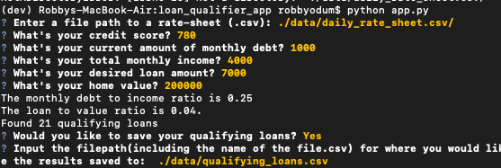
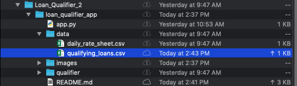
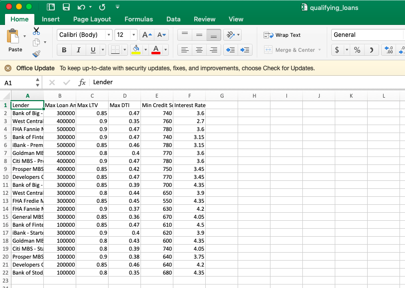

# Loan Qualifier V.2.0

This application determines what banks the user would qualify for a loan at based on the user input criteria of credit score, income, debt amount, loan amount requested, and home value. The bank information is called from the daily rate sheet csv file. The resulting loans the user qualifies for can then be saved as a csv file to the location of the user's choosing.

---

## Technologies

This application is written in Python v. 3.9.7 and uses the following libraries:

[fire](https://readthedocs.org/projects/python-fire/) was used for command line interface

[questionary](https://questionary.readthedocs.io/en/stable/) was used to prompt the user for input

[csv](https://docs.python.org/3/library/csv.html) was used in order to read and create csv files

[pathlib](https://docs.python.org/3/library/pathlib.html) was used to call on various files and to save the resulting csv file

[sys](https://docs.python.org/3/library/sys.html) was used to exit the application

---

## Installation Guide

Prior to running this application, perform the following in the command line to install the required libraries:

`pip install fire`

`pip install questionary`

`pip install csv`

`pip install pathlib`

`pip install sys`

---

## Usage

In order to launch the application, type into the command line:

```python 
Python app.py
```

The user will then be prompted to input the file path to the csv containing the bank data, i.e. the daily rate sheet file. Next, the user will be prompted to input their credit score, debt amount, income, loan amount, and home value. Following these entries, the program will output the monthly debt to income ratio, the loan to value ratio, and the number of qualifying loans found given the criteria. The user will then be prompted asking whether they would like to save the resulting loans they qualify for. If the user selects 'yes', then they will also be prompted for the filepath they would like to save the loans to as a csv file.

Here is an example of input criteria and the resulting output of the application:



Here is where the qualifying loans csv was saved to:



Here is the resulting loan data:



---

## Contributors

Robby Odum, Email: rodum012@gmail.com

---

## License

MIT
